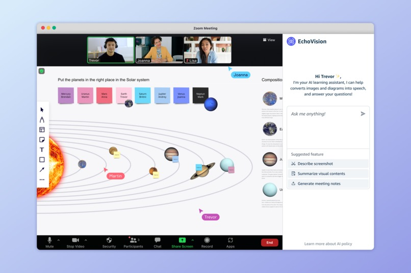

# EchoVision
A full-stack screen-capture &amp; AI-analysis toolkit: a Tampermonkey userscript to grab on-screen content from any web app, and a Flask/GCP AI backend that delivers accessibility-focused insights.

# How we built it
The system utilizes Google Cloud Platform and Gemini Pro 2.5's multimodal capabilities to process image and text inputs. When users submit an image with questions, the system analyzes both through integrated AI agents managed by the Google Cloud SDK. After validation, responses are delivered to the frontend for visual or audio consumption, leveraging GCP's scalability and Gemini's advanced processing capabilities.

# What it does
EchoVision is an AI-powered browser plugin that converts images shown during online classes into descriptive audio, in real time. It detects visual content (including uploaded slides, shared screens, or in-browser images), extracts meaningful context, and provides accurate, dynamic audio narration. It’s designed to work seamlessly with screen readers and helps all learners better access visual information.

# Installation
1. Please install tempermonkey from the chrome web store (here)[https://chromewebstore.google.com/detail/tampermonkey/dhdgffkkebhmkfjojejmpbldmpobfkfo?hl=en]
2. install, or copy and paste frontend/plugin.user.js into the tempermonkey.

3. Enable the script in the tempermonkey, share the screen properly, and ask your questions.

# Sample Demo

